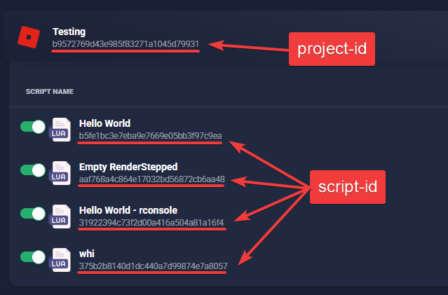

# Luarmor Deploy

Deploy your script file to Luarmor.

> [!WARNING]
> You must self-host your GitHub runner and whitelist your server's IP on the Luarmor site for this to work. This is due to limitations imposed by Luarmor themselves.

## Inputs



### `api-key`

**Required** Your secret Luarmor API key. This should be stored in GitHub secrets.

### `script-id`

**Required** The id of the script you want to upload the [file](#file) to. 

### `project-id`

**Optional** The id of the project that the [script](#script-id). If this is not specified, it's automatically resolved for you.

### `file`

**Required** The path to the script file to deploy.

## Outputs

N/A

## Example usage

```yaml
name: Deploy Script

on:
  push:
    branches:
      - main

jobs:
  deploy:
    runs-on: [self-hosted]

    steps:
    - name: Checkout repository
      uses: actions/checkout@v2

    - name: Deploy to Luarmor
      uses: stefanuk12/luarmor-deploy-action@v1.0.0
      with:
        api-key: ${{ secrets.LUARMOR_API_KEY }}
        script-id: "your-script-id"
        project-id: "your-project-id" # Optional
        file: "path/to/your/script/file"
```